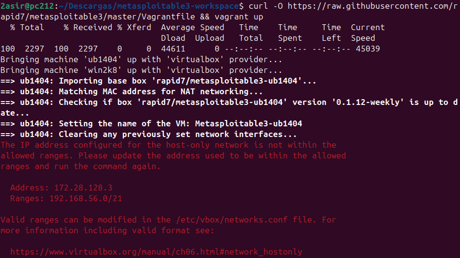

# Metasploitable 3 installation on Ubuntu 24.04
## [Spanish](https://github.com/JesusGonzalezAragon/instalacion-metasploitable3)

---
### Start

To use Metasploitable 3, we will need to do a couple of things first:
* [Install Vagrant](https://developer.hashicorp.com/vagrant/install?product_intent=vagrant) 
* Create a configuration file in /etc/vbox
* Virtualbox 7.0 or lower (Virtualbox 7.1 is not supported)

> We can use other supported hypervisors such as VMware and Hyper-V.

### Install Vagrant
Let's start by going to the link above for [Vagrant](https://developer.hashicorp.com/vagrant/install?product_intent=vagrant), as we can see if we scroll down a bit, we find the Linux option.

```shell
wget -O- https://apt.releases.hashicorp.com/gpg| sudo gpg --dearmor -o /usr/share/keyrings/hashicorp-archive-keyring.gpg

echo "deb [signed-by=/usr/share/keyrings/hashicorp-archive-keyring.gpg] https://apt.releases.hashicorp.com $(lsb_release -cs) main" | sudo tee /etc/apt/sources.list.d/hashicorp.list

sudo apt update && sudo apt install vagrant
```

Now, we create [Metasploitable 3](https://github.com/rapid7/metasploitable3) directory
```shell
mkdir metasploitable3-workspace
```

We continue by entering the directory and downloading the files using curl:
```shell
cd metasploitable3-workspace

curl -O https://raw.githubusercontent.com/rapid7/metasploitable3/master/Vagrantfile && vagrant up
```

### VirtualBox error

You will probably get the same error, because we have not configured the file that goes in **/etc/vbox**. It tells us that the IP address configured for the host is not within the allowed ranges, so we are going to make it so.

> First we have to create the path **/etc/vbox** with the networks.conf file, as neither the directory nor the file are there by default.

```shell
sudo mkdir /etc/vbox
sudo nano /etc/vbox/networks.conf
```

To allow the range, in this case the **network 172.28.0.0/16** (To avoid problems, as we could allow only the IP).

We introduce the following:

``` title:"networks.conf"
* 172.28.0.0/16
* 192.168.56.0/24
```

> The 192.168.56.0 is the network for the Windows machine, if we don't add it, it will give us another error when doing `vagrant up`.
> >**Caution! I have taken the range based on the address that gave me the error in the previous image, it is also mandatory to use the * to indicate the beginning of the range or the IP that we are going to declare in the configuration file**.

And we do a `vagrant up` again in the **metasploitable3-workspace** directory, when we do this, it will start importing the vulnerable Linux and Windows machines into VirtualBox. When finished, if we go to VirtualBox, we will see the 2 machines imported and running.
### Result

The result should be that we have 2 machines that we didn't have before and in a state of *Running*.
